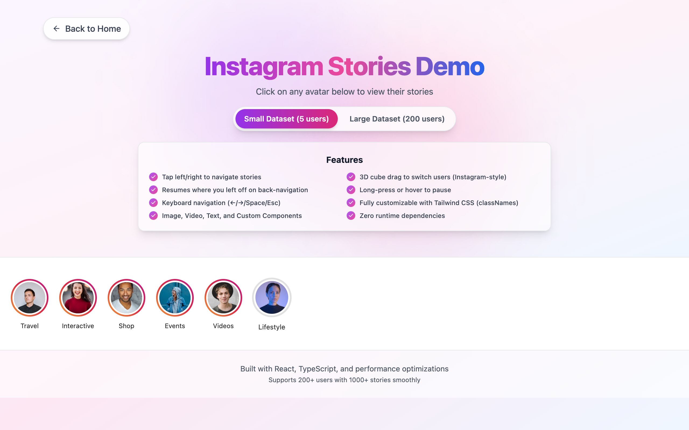
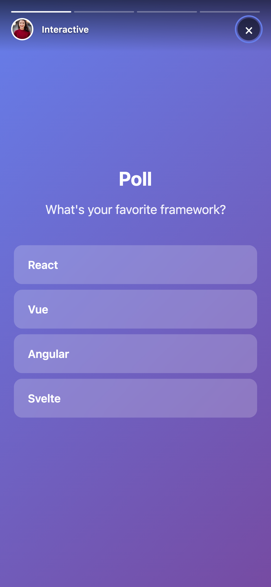

# React Instagram Stories

A high-performance, fully customizable Instagram-style Stories component for React with TypeScript support. Build engaging story experiences with images, videos, text, and custom components.

[](https://www.npmjs.com/package/react-instagram-stories)
[](https://opensource.org/licenses/MIT)

## Preview

<p align="center">
  
</p>

<p align="center">
  
</p>

<p align="center">
  
  &nbsp;&nbsp;
  
</p>

## Features

- **Multiple Content Types**: Images, videos (with audio), text, and fully custom components
- **Fully Customizable**: Style every aspect of the stories
- **High Performance**: Optimized rendering with intelligent preloading
- **Touch & Gestures**: Tap, swipe, and hold interactions
- **Keyboard Navigation**: Full keyboard support for accessibility
- **TypeScript**: Complete type definitions included
- **Accessible**: ARIA labels and keyboard navigation
- **Tailwind CSS Support**: Customize every sub-element via `classNames` prop with Tailwind or custom CSS classes
- **3D Cube Transition**: Instagram-style 3D cube drag transition when switching between users
- **Story Resume**: Dragging back to a previous user resumes their story from where you left off
- **Lightweight**: ~30 KB with zero runtime dependencies
- **No Router Required**: Works with native browser history API
- **URL Navigation**: Built-in query parameter support (`?user=userId&story=storyId`)
- **Auto Progress**: Smart progress bar that pauses during video buffering
- **Smooth Transitions**: 3D cube drag transitions between users, smooth animations between stories

## Installation

```bash
npm install react-instagram-stories
# or
yarn add react-instagram-stories
# or
pnpm add react-instagram-stories
```

**Note**: No additional dependencies required! Works without react-router-dom.

## Quick Start

### Simple Usage (Recommended)

```tsx
import { Stories, demoUsers } from "react-instagram-stories";
import "react-instagram-stories/styles.css";

function App() {
  return <Stories users={demoUsers} />;
}

export default App;
```

That's it! Click on any avatar to open the story viewer. The URL automatically updates to `?user=userId&story=storyId` format.

### Using Separate Components

```tsx
import {
  AvatarList,
  StoryViewer,
  demoUsers,
  navigateWithParams,
} from "react-instagram-stories";
import "react-instagram-stories/styles.css";

function App() {
  const handleAvatarClick = (userIndex: number) => {
    const user = demoUsers[userIndex];
    // Navigate using user ID and story ID
    navigateWithParams({ user: user.id, story: user.stories[0].id });
  };

  return (
    <div>
      <h1>My App</h1>
      <AvatarList users={demoUsers} onAvatarClick={handleAvatarClick} />
      <StoryViewer users={demoUsers} />
    </div>
  );
}
```

## URL Navigation

The StoryViewer supports URL-based navigation using query parameters with **user ID** and **story ID**:

| URL                                | Result                              |
| ---------------------------------- | ----------------------------------- |
| `?user=user-travel&story=travel-1` | Opens Travel user's first story     |
| `?user=user-polls&story=poll-1`    | Opens Interactive user's poll story |
| `?user=user-launch&story=launch-2` | Opens Events user's second story    |
| No query params                    | Viewer stays closed                 |

### Navigation Helpers

```tsx
import { navigateWithParams, clearQueryParams } from "react-instagram-stories";

// Open story viewer with user ID and story ID
navigateWithParams({ user: "user-travel", story: "travel-1" });

// Close story viewer (clear params)
clearQueryParams();
```

## API Reference

### `<Stories />` Component

The all-in-one component with avatar list and story viewer.

```tsx
import { Stories } from "react-instagram-stories";

<Stories users={myUsers} />;
```

| Prop         | Type                | Default      | Description                                                      |
| ------------ | ------------------- | ------------ | ---------------------------------------------------------------- |
| `users`      | `User[]`            | **required** | Array of user objects with their stories                         |
| `classNames` | `StoriesClassNames` | -            | Object to customize sub-element CSS classes (Tailwind or custom) |

### `<StoryViewer />` Component

The story viewer component. Supports two modes:

#### Query Param Mode (Default)

When `isOpen` is not provided, reads from URL query params:

```tsx
<StoryViewer users={myUsers} />
```

#### Controlled Mode

When `isOpen` is provided, you control the viewer state:

```tsx
<StoryViewer
  users={myUsers}
  isOpen={true}
  initialUserIndex={0}
  initialStoryIndex={0}
  onClose={() => console.log("closed")}
  onStoryChange={(userIndex, storyIndex) => console.log(userIndex, storyIndex)}
/>
```

| Prop                | Type                              | Default      | Description                                                      |
| ------------------- | --------------------------------- | ------------ | ---------------------------------------------------------------- |
| `users`             | `User[]`                          | **required** | Array of user objects                                            |
| `isOpen`            | `boolean`                         | -            | Controls viewer visibility (enables controlled mode)             |
| `initialUserIndex`  | `number`                          | `0`          | Starting user index                                              |
| `initialStoryIndex` | `number`                          | `0`          | Starting story index                                             |
| `onClose`           | `() => void`                      | -            | Called when viewer closes                                        |
| `onStoryChange`     | `(userIndex, storyIndex) => void` | -            | Called when story changes                                        |
| `classNames`        | `StoryViewerClassNames`           | -            | Object to customize sub-element CSS classes (Tailwind or custom) |

### `<AvatarList />` Component

The horizontal scrollable avatar list.

```tsx
<AvatarList
  users={myUsers}
  onAvatarClick={(userIndex) => console.log(userIndex)}
/>
```

| Prop            | Type                          | Description                                                      |
| --------------- | ----------------------------- | ---------------------------------------------------------------- |
| `users`         | `User[]`                      | Array of user objects                                            |
| `onAvatarClick` | `(userIndex: number) => void` | Called when avatar is clicked                                    |
| `classNames`    | `AvatarListClassNames`        | Object to customize sub-element CSS classes (Tailwind or custom) |

## Story Types

### 1. Image Story

```tsx
{
  id: 'unique-id',
  type: 'image',
  src: 'https://example.com/image.jpg',
  alt: 'Description', // Optional
  duration: 5000, // Optional, default: 5000ms
}
```

### 2. Video Story

```tsx
{
  id: 'unique-id',
  type: 'video',
  src: 'https://example.com/video.mp4',
  duration: 10000, // Optional, auto-detected from video
}
```

**Features:**

- Audio enabled by default
- Progress bar pauses during buffering
- Auto-detects video duration

### 3. Text Story

```tsx
{
  id: 'unique-id',
  type: 'text',
  text: 'Hello World!',
  backgroundColor: '#FF6B6B', // Optional, default: '#000'
  textColor: '#FFFFFF', // Optional, default: '#fff'
  duration: 5000,
}
```

### 4. Custom Component Story

Add ANY custom React component as a story!

```tsx
const MyCustomStory: React.FC<StoryItemControls> = ({
  pause,
  resume,
  next,
  prev,
  setDuration
}) => {
  return (
    <div style={{ height: '100%', background: '#667eea', padding: '20px' }}>
      <h1>Custom Content</h1>
      <button onClick={next}>Next Story</button>
    </div>
  );
};

// In your stories array:
{
  id: 'unique-id',
  type: 'custom_component',
  component: MyCustomStory,
  duration: 5000,
}
```

**Control Methods Available:**

- `pause()` - Pause the story timer
- `resume()` - Resume the story timer
- `next()` - Go to next story
- `prev()` - Go to previous story
- `setDuration(ms: number)` - Update story duration dynamically

## Custom Component Examples

Build interactive experiences! Here are examples included in `demoUsers`:

### Poll Component

```tsx
const PollComponent: React.FC<StoryItemControls> = ({
  pause,
  resume,
  next,
}) => {
  const [selected, setSelected] = React.useState<number | null>(null);
  const [votes, setVotes] = React.useState([42, 28, 18, 12]);
  const options = ["React", "Vue", "Angular", "Svelte"];

  React.useEffect(() => {
    pause(); // Pause timer during interaction
    return () => resume();
  }, [pause, resume]);

  const handleVote = (index: number) => {
    setSelected(index);
    const newVotes = [...votes];
    newVotes[index] += 1;
    setVotes(newVotes);

    setTimeout(() => {
      resume();
      next();
    }, 2000);
  };

  const total = votes.reduce((a, b) => a + b, 0);

  return (
    <div
      style={{
        display: "flex",
        flexDirection: "column",
        height: "100%",
        background: "linear-gradient(135deg, #667eea 0%, #764ba2 100%)",
        padding: "20px",
      }}
    >
      <h2 style={{ color: "white", marginBottom: "20px" }}>
        What's your favorite framework?
      </h2>
      {options.map((option, index) => (
        <button
          key={index}
          onClick={() => handleVote(index)}
          disabled={selected !== null}
          style={{
            margin: "8px 0",
            padding: "15px",
            background:
              selected === index ? "#4CAF50" : "rgba(255,255,255,0.2)",
            color: "white",
            border: "none",
            borderRadius: "12px",
            fontSize: "16px",
            cursor: selected !== null ? "default" : "pointer",
          }}
        >
          <div style={{ display: "flex", justifyContent: "space-between" }}>
            <span>{option}</span>
            {selected !== null && (
              <span>{((votes[index] / total) * 100).toFixed(0)}%</span>
            )}
          </div>
        </button>
      ))}
    </div>
  );
};
```

**Tip**: All these examples are included in `demoUsers`! Import and use them to see how they work.

## Styling

Import the default styles:

```tsx
import "react-instagram-stories/styles.css";
```

**With Tailwind CSS**: Import the library styles **before** your Tailwind CSS so that utility classes can override them:

```css
/* Your global CSS file */
@import "react-instagram-stories/styles.css";

@tailwind base;
@tailwind components;
@tailwind utilities;
```

Or in JS, import the library CSS before your app's CSS:

```tsx
// main.tsx
import "react-instagram-stories/styles.css"; // first
import "./index.css"; // your Tailwind CSS — after
```

Override with custom CSS:

```css
/* Override story viewer background */
.story-viewer {
  background: rgba(0, 0, 0, 0.95);
}

/* Customize progress bars */
.story-progress-bar {
  background: rgba(255, 255, 255, 0.3);
}

.story-progress-bar-fill {
  background: linear-gradient(to right, #ff6b6b, #ee5a6f);
}

/* Style avatars */
.story-avatar-list {
  padding: 20px;
  gap: 16px;
}

.story-avatar-image-wrapper {
  width: 80px;
  height: 80px;
}
```

## Customization with classNames

Every component accepts a `classNames` prop for fine-grained styling using Tailwind CSS or custom CSS classes. The prop is a typed object that maps to specific sub-elements.

```tsx
<Stories
  users={users}
  classNames={{
    avatarList: {
      root: "bg-gray-900 p-4",
      avatar: { ring: "border-pink-500", username: "text-xs text-gray-400" },
    },
    storyViewer: {
      overlay: "bg-black/90",
      closeButton: "hover:text-gray-300",
      progressBars: {
        bar: { fill: "bg-gradient-to-r from-pink-500 to-purple-500" },
      },
    },
  }}
/>
```

You can also pass `classNames` directly to `StoryViewer` or `AvatarList` when using them separately:

```tsx
<AvatarList
  users={users}
  onAvatarClick={handleClick}
  classNames={{
    root: "bg-gray-900 p-4",
    avatar: { ring: "border-pink-500", username: "text-xs text-gray-400" },
  }}
/>

<StoryViewer
  users={users}
  classNames={{
    overlay: "bg-black/90",
    closeButton: "hover:text-gray-300",
    progressBars: { bar: { fill: "bg-gradient-to-r from-pink-500 to-purple-500" } },
  }}
/>
```

All `classNames` types are exported from the package. See the [TypeScript Types](#typescript-types) section for the full list.

## Advanced Usage

### Using Demo Data

```tsx
import { Stories, demoUsers } from "react-instagram-stories";
import "react-instagram-stories/styles.css";

function App() {
  return <Stories users={demoUsers} />;
}
```

The `demoUsers` includes examples of all story types including interactive polls, quizzes, countdowns, and sliders!

### Generate Demo Users

```tsx
import { generateDemoUsers } from "react-instagram-stories";

const users = generateDemoUsers(10); // 10 users with random stories
```

### Create Custom Stories

```tsx
import type { User } from "react-instagram-stories";

const myUsers: User[] = [
  {
    id: "1",
    username: "johndoe",
    avatarUrl: "https://example.com/avatar.jpg",
    hasUnreadStories: true, // Shows ring around avatar
    stories: [
      {
        id: "story-1",
        type: "image",
        src: "https://example.com/photo.jpg",
        alt: "Beach sunset",
        duration: 5000,
      },
      {
        id: "story-2",
        type: "video",
        src: "https://example.com/video.mp4",
        // duration auto-detected
      },
      {
        id: "story-3",
        type: "text",
        text: "Hello from my story!",
        backgroundColor: "#FF6B6B",
        textColor: "#FFFFFF",
        duration: 5000,
      },
      {
        id: "story-4",
        type: "custom_component",
        component: MyPollComponent,
        duration: 10000,
      },
    ],
  },
];
```

### Controlled Mode (Without URL)

If you don't want URL navigation, use controlled mode:

```tsx
import { useState } from "react";
import { AvatarList, StoryViewer } from "react-instagram-stories";

function App() {
  const [viewerState, setViewerState] = useState({
    isOpen: false,
    userIndex: 0,
  });

  return (
    <>
      <AvatarList
        users={myUsers}
        onAvatarClick={(index) =>
          setViewerState({ isOpen: true, userIndex: index })
        }
      />
      <StoryViewer
        users={myUsers}
        initialUserIndex={viewerState.userIndex}
        isOpen={viewerState.isOpen}
        onClose={() => setViewerState({ isOpen: false, userIndex: 0 })}
      />
    </>
  );
}
```

## Keyboard Controls

- `←` `→` - Navigate stories
- `Space` - Pause/Resume
- `Esc` - Close viewer

## Mouse & Touch

- **Tap Left/Right** - Navigate stories
- **Swipe Left/Right** - Change users
- **Drag Left/Right** - 3D cube transition between users (peek at next/previous user, snaps on release)
- **Swipe Down** - Close
- **Hold/Hover** - Pause

## TypeScript Types

```tsx
import type {
  User,
  StoryItem,
  StoryItemType,
  StoryItemControls,
  ImageStoryItem,
  VideoStoryItem,
  TextStoryItem,
  CustomComponentStoryItem,
  StoriesClassNames,
  StoryViewerClassNames,
  AvatarListClassNames,
  AvatarClassNames,
  StoryProgressBarsClassNames,
  ProgressBarClassNames,
  StoryItemClassNames,
} from "react-instagram-stories";

// Core Types
type StoryItemType = "image" | "video" | "text" | "custom_component";

interface StoryItemControls {
  pause: () => void;
  resume: () => void;
  next: () => void;
  prev: () => void;
  setDuration: (ms: number) => void;
}

interface User {
  id: string;
  username: string;
  avatarUrl: string;
  stories: StoryItem[];
  hasUnreadStories?: boolean;
}

// ClassNames Types (for Tailwind / custom CSS customization)
interface StoriesClassNames {
  avatarList?: AvatarListClassNames;
  storyViewer?: StoryViewerClassNames;
}

interface AvatarListClassNames {
  root?: string;
  avatar?: AvatarClassNames;
}

interface AvatarClassNames {
  root?: string;
  ring?: string;
  image?: string;
  username?: string;
}

interface StoryViewerClassNames {
  overlay?: string;
  closeButton?: string;
  progressBars?: StoryProgressBarsClassNames;
  storyItem?: StoryItemClassNames;
}

interface StoryProgressBarsClassNames {
  root?: string;
  bar?: ProgressBarClassNames;
}

interface ProgressBarClassNames {
  root?: string;
  fill?: string;
}

interface StoryItemClassNames {
  root?: string;
}
```

## Package Exports

```tsx
// Components
import { Stories, StoryViewer, AvatarList } from "react-instagram-stories";

// Navigation helpers
import { navigateWithParams, clearQueryParams } from "react-instagram-stories";

// Demo data
import { demoUsers, generateDemoUsers } from "react-instagram-stories";

// Types
import type {
  User,
  StoryItem,
  StoryItemControls,
  StoryItemType,
  ImageStoryItem,
  VideoStoryItem,
  TextStoryItem,
  CustomComponentStoryItem,
  StoriesClassNames,
  StoryViewerClassNames,
  AvatarListClassNames,
  AvatarClassNames,
  StoryProgressBarsClassNames,
  ProgressBarClassNames,
  StoryItemClassNames,
} from "react-instagram-stories";

// Styles
import "react-instagram-stories/styles.css";
```

## Performance

- **Bundle Size**: ~30 KB (minified)
- **Gzipped**: ~10 KB
- **Zero Runtime Dependencies**: No production dependencies at all (framer-motion and tailwindcss-animate are dev-only)
- **Smart Preloading**: Preloads adjacent stories
- **Optimized Rendering**: Uses React.memo
- **Video Buffering Detection**: Pauses progress during buffering

## Tech Stack

- React 18+
- TypeScript
- CSS 3D Transforms (cube transition between users)
- Native Browser History API (no router needed)
- tsup (bundler)

## Contributing

Contributions welcome! Open an issue or PR.

## License

MIT © [Ankit Jangir](https://github.com/ankit64jangir)

## Support

- [Issues](https://github.com/ankit64jangir/react-instagram-stories/issues)
- [Discussions](https://github.com/ankit64jangir/react-instagram-stories/discussions)
- [Star on GitHub](https://github.com/ankit64jangir/react-instagram-stories)

---

Made with love by Ankit Jangir
